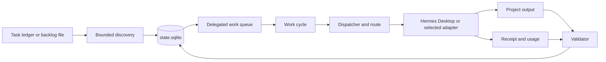

# AI Orchestrator Instruction Manual

> **Current behavior versus intended system.** This manual documents the implementation that is presently running. It is not an endorsement of every current lane. The intended system is an AI operating system: Hermes Desktop is the human-facing kernel, the Orchestrator is the vendor-neutral brain and visualizer, and work progresses from intent or contracted packet through delivery to a real consumer. The automatic source-backed backlog lane described below is a current deviation under review, not the architecture's definition of success.

## What the system is

The AI Orchestrator is the local control plane for AI-assisted project work on this PC. It does five jobs:

1. Discovers explicit unfinished work from bounded project ledgers.
2. Records work, routes, attempts, receipts, and evidence in a local SQLite state store.
3. Chooses and runs an adapter appropriate to the work and the machine’s policy.
4. Verifies that a result has the output shape and receipt the task required.
5. Keeps moving through eligible projects without asking for a hand-authored work queue.

It is not a chat frontend and it is not merely a dashboard. The dashboard shows the state of a scheduler, dispatcher, adapters, and receipts that run locally.

## The UI: what it does and what it does not do

The UI is a real operating surface at `http://127.0.0.1:8765/`, but each screen has a different authority boundary:

| Screen | What it is for | What it does not prove or control |
|---|---|---|
| Home dashboard | Control-plane summary, fleet summary, route recommendation, dispatch telemetry, and shortcuts. The route form loads its job classes from the current database registry and shows API errors. | It does not display the source-backed work queue or start queued project work through the Route form. |
| Command Center | Live local API panels for the Orchestrator and service fleet; provider-quota presentation; business-connector snapshot. | Its Gmail, Drive, QuickBooks, and Calendar cards come from the displayed `business_snapshot.json` timestamp. They are not a live connector query. |
| Workers | Searchable configured-worker and model-capability inventory. | A catalog entry is not a health check, quota guarantee, or runtime receipt. |
| Budgets | Provider usage evidence, quota windows, and explicit refresh buttons. | `unproved`, `auth_required`, and session-only evidence are not usable remaining-quota facts. A refresh button probes the provider and changes the local budget record. |
| Connectors | Registered service health and a no-secret MCP configuration preview. | Generating a preview is not installing or authorizing a connector. |
| Receipts | Dispatcher receipt history, searchable by job class and outcome. | Historical `N/A`, zero-token, or legacy rows are not source-backed project completion proof. |

The source-backed project-work queue lives in the SQLite state store and the CLI/API work commands, not in the current visual dashboard. Use `work-status` for `queued`, `running`, `completed`, `failed`, and `held` source work. Use the UI to inspect its surrounding operational conditions.

## The operating model



The source file supplies the task. The state store supplies the lifecycle. The adapter performs the work. The receipt and validator decide whether the result is usable.

## Sources of work

The automatic backlog lane reads explicit project files only:

- `TASKS.yaml` and `TASKS.yml`
- `TODO.md`
- `BACKLOG.md`
- `PLAN.md`

It uses six bounded roots listed in the quick-start guide. A root is searched with targeted filename patterns. If that fast search times out, discovery stops for that root; it does not turn into a slow walk of the entire shared drive.

The discoverer extracts task identifiers, titles, descriptions, and statuses. Its actionable statuses are `active`, `in_progress`, `in-progress`, `ready`, `queued`, and `blocked`. An invalid YAML ledger becomes a repair candidate rather than an invisible omission.

### Source-backed work contract

Every promoted source task receives an instruction that names:

- the source file and source task ID;
- the task title and description;
- the exact project root;
- the local-only action boundary;
- the JSON output contract.

The instruction tells the worker that the stated project root is the filesystem authority, even when it is not a Git repository. It must not search the user profile for a different repository or another source of direction.

## Work lifecycle

There are two connected records:

| Record | Purpose |
|---|---|
| `discovered_work_items` | The source-ledger candidate and its fingerprint. |
| `delegated_work_items` | A concrete queued or executed work item. |

The ordinary lifecycle is:

```text
discovered → promoted → queued → running → completed
```

Other normal states are `held`, `awaiting_approval`, and `failed`.

When a source-backed item fails because its adapter output is missing or invalid, the historical work item remains failed. On the next discovery pass, if the same source task still exists, its source candidate becomes discoverable again and can receive a new work item. The system does not overwrite the failed record or pretend it never happened.

Only one source-backed task can run in a project root at a time. If that project is busy, the work cycle defers its queued items and can select a task from another project.

## The dispatcher and routing

The dispatcher turns text into an intent, identifies the job class, loads project policy and worker information, and records a routing decision. The decision contains the candidate adapters, the selected adapter, the model/provider hints, and the reason for the choice.

There are two important paths:

### Direct work

A person can use `dispatch`, `route --execute`, or `work-submit`. The normal approval rules apply. The system can create an approval request for high-consequence or external work.

### Source-backed local work

Work promoted from a project ledger is already bounded to an existing local project root. The work cycle authorizes that local action path without creating a prompt-fed approval queue and pins it to `hermes-agent`. It does not grant permission to send messages, change external systems, or operate outside the stated project root.

## Hermes Desktop lane

`hermes-agent` is the preferred execution adapter for source-backed local project work.

1. The adapter invokes the governed shim at `.runtime\ai-resource-governor\bin\hermes.ps1`.
2. The shim sets `HERMES_HOME` to the Desktop Hermes installation under `%LOCALAPPDATA%\hermes`.
3. The shim routes prompt work through the orchestrator’s Hermes route command.
4. A Python argument bridge preserves JSON and quoted prompts across PowerShell and Windows process boundaries.
5. Hermes receives the project root as its working directory and is allowed up to 900 seconds for a substantive source task.
6. The usage receipt records the provider and model that actually performed the work.

Desktop Hermes health means the Desktop runtime reports a configured model and provider and can run through the governed path. A portal-login status alone does not decide adapter health.

## Validation and proof

Source-backed work requires all of the following:

1. The dispatch finishes in `completed` state.
2. The project output file exists.
3. The project receipt file exists.
4. The task output parses as JSON.
5. It contains `terminal_state: produced`, a `summary` containing `source` and `task`, and a `next_action` containing `evidence`.
6. The operation validator reaches the configured minimum score, normally `1.0`.

The project-local output path is:

```text
<project-root>\ORCHESTRATOR_OUTPUT\<YYYY-MM-DD>\<intent-id>\
```

The central state and runtime evidence live under:

```text
.runtime\orchestrator\state.sqlite
.runtime\orchestrator\supervisor\
.runtime\ai-resource-governor\receipts\hermes-desktop\
```

## Scheduler and service

The FastAPI application starts a background supervisor thread. The supervisor ticks every 60 seconds and keeps three interval tasks registered:

| Scheduler task | Interval | What it does |
|---|---:|---|
| `task_backlog_discovery` | 15 minutes | Discovers and promotes bounded source work. |
| `task_delegated_work_cycle` | 5 minutes | Executes one eligible queued item. |
| `task_budget_probes_cron` | 15 minutes | Refreshes subscription and quota observations. |

The API listens on `127.0.0.1:8765`. The watchdog start script launches it without a visible console and writes start receipts to the supervisor directory.

## Interfaces

### Local web interface

| URL | Use |
|---|---|
| `/` | Command-center interface. |
| `/workers` | Worker and service information. |
| `/budget` | Budget and subscription observations. |
| `/receipts` | Recorded dispatch receipts. |
| `/api/dashboard-status` | Aggregate live health. |
| `/api/services` | Current adapter health. |
| `/api/dispatches` | Dispatch history. |
| `/api/scheduler/tasks` | Scheduler inventory. |

### Core CLI commands

```powershell
python -m orchestrator.cli.main dashboard-status --no-receipt
python -m orchestrator.cli.main work-discover --limit 3
python -m orchestrator.cli.main work-status --last 20
python -m orchestrator.cli.main work-cycle --limit 1
python -m orchestrator.cli.main route --job-class repo_coding --text "Inspect this project" --dry-run
python -m orchestrator.cli.main trigger-scheduler-task task_delegated_work_cycle
```

Use `--dry-run` when you want a route decision without starting a worker. `work-cycle` and `trigger-scheduler-task` can start work.

## What the dashboard means

`healthy` means the local control plane, service fleet, route panel, database read, and recent supervisor proof are healthy. A stale `business_snapshot` remains visible in `components.data_freshness.advisories`; it is not treated as a scheduling or dispatch failure.

The dashboard is a health surface. Receipts and project artifacts are the proof surface for work results.

For intervention and recovery, use [Operator Manual](OPERATOR_MANUAL.md).
